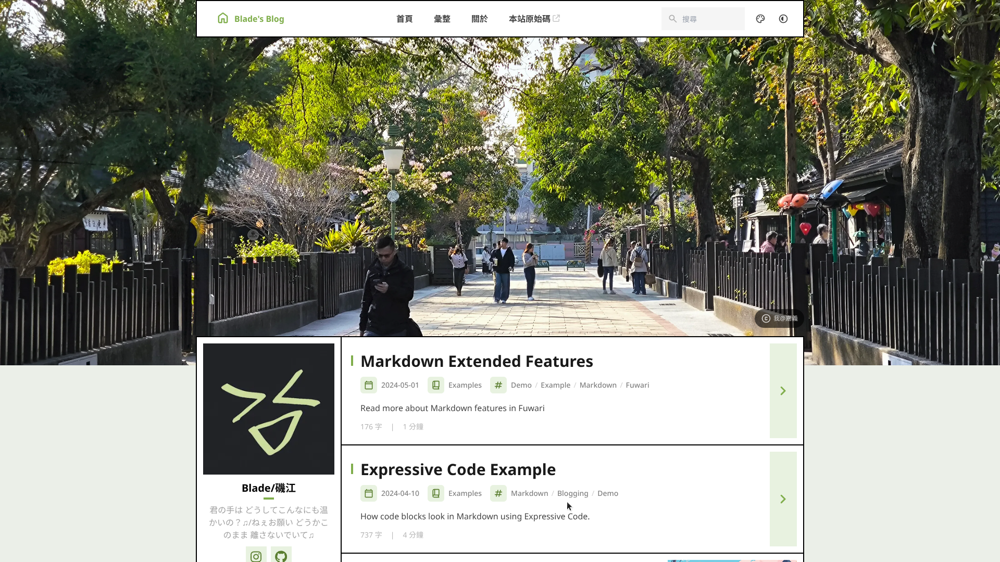

# 🗡️Blade's Blog v2


A static blog built with [Astro](https://astro.build) and template [Fuwari](https://github.com/saicaca/fuwari).



## 🚀 Getting Started

- Clone the repository, install dependencies, and preview locally:
    ```shell
    git clone https://github.com/minstrike520/blog-fuwari
    pnpm install
    pnpm dev
    ```
- Bulid, check and deploy:
    ```shell
    pnpm build
    pnpm check
    git push # Alternatively, you can self-host the website (e.g. `python -m http.server`). Build artifact is under `/dist`.
    ```

## 📝 Frontmatter of Posts

```yaml
---
title: My First Blog Post
published: 2026-02-02
description: This is the first post of my new Astro blog.
image: ./cover.jpg
tags: [Foo, Bar]
category: Front-end
draft: false
lang: jp      # Set only if the post's language differs from the site's language in `config.ts`
---
```

## ⚡ Commands

All commands are run from the root of the project, from a terminal:

| Command                    | Action                                              |
|:---------------------------|:----------------------------------------------------|
| `pnpm install`             | Installs dependencies                               |
| `pnpm dev`                 | Starts local dev server at `localhost:4321`         |
| `pnpm build`               | Build your production site to `./dist/`             |
| `pnpm preview`             | Preview your build locally, before deploying        |
| `pnpm check`               | Run checks for errors in your code                  |
| `pnpm format`              | Format your code using Biome                        |
| `pnpm new-post <filename>` | Create a new post                                   |
| `pnpm astro ...`           | Run CLI commands like `astro add`, `astro check`    |
| `pnpm astro --help`        | Get help using the Astro CLI                        |

## 📄 License

- **Code**: The theme and underlying source code are licensed under [MIT](LICENSE).
- **Content**: All blog posts and media content are licensed under [CC BY-NC-SA 4.0](https://creativecommons.org/licenses/by-nc-sa/4.0/).
