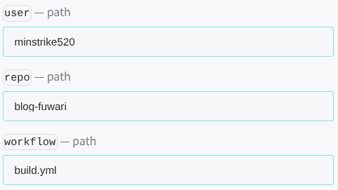
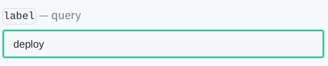
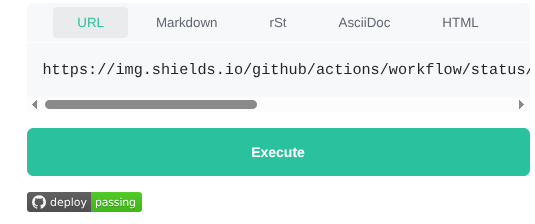

參考：[DD - 為你的開源專案產生動態Badge(徽章)](https://studyhost.blogspot.com/2020/07/badge_47.html)

> 我在搞部落格的時候，發現 README 還是 Fuwari 的預設內容，心想既然都是第二次搞了，應該做得有模有樣一點吧！然後開始重寫。然後我想到，一般 repo 不是都會加個小圖案寫著「build passing」之類的嗎？我也想要這個！

[shields.io](https://shields.io/) 有提供很多種徽章。

我想要監控部落格的部署情況，所以使用 [Shields.io - GitHub Actions Workflow Status](https://shields.io/badges/git-hub-actions-workflow-status)。

注意到 `workflow` 欄位是要填入對應 workflow 的頁面。頁面名稱對應到你在 `/.github/workflows/` 底下放的 YAML 設定檔。比如，我的部落格有

- [`.github/workflows/build.yml`](https://github.com/minstrike520/blog-fuwari/blob/main/.github/workflows/build.yml)

那麼 GitHub 中對應的 workflow 頁面就是在

- [github.com/minstrike520/blog-fuwari/actions/workflows/build.yml](https://github.com/minstrike520/blog-fuwari/actions/workflows/build.yml)



---

除此之外，這個徽章預設顯示「build」。可是我也有 [deploy](https://github.com/minstrike520/blog-fuwari/actions/workflows/deploy.yml) 想顯示啊！此時就要看到 `label` 欄位。



還可以新增圖標，這邊加一個 GitHub 的圖案上去。:spoiler[不加不對味啊！]


Enter 或按 Execute 之後可以看到預覽：



選到 markdown 那個欄位就可以複製 markdown 語法的嵌入。（我還以為得用 HTML tag 耶，原來 Markdown 這麼能打？）

```markdown

```

顯示在這裡！  （如果沒有壞掉的話）
ㄕ