[課程總覽](../)

## Week 3: MQTT Implementation

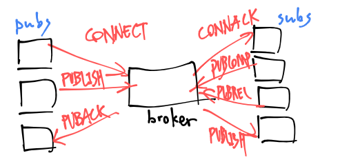

<center><i>Figure 1: some of the requests and responses specified in MQTT</i></center>

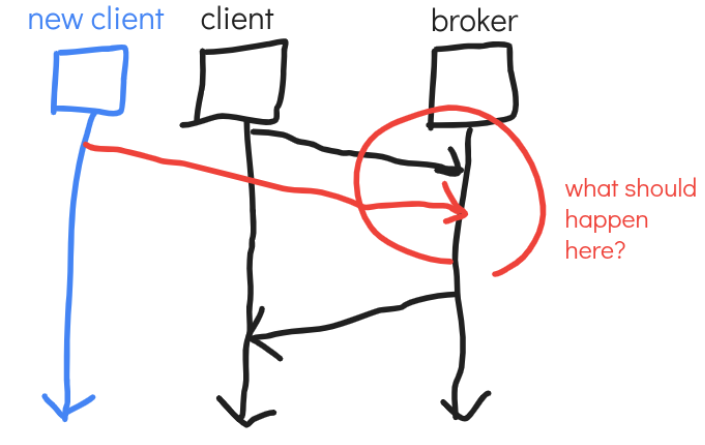

<center><i>Figure 2: a scenario that the broker has to deal with multiple messages “at once”</i></center>
One way to deal with such a situation is to implement the broker program *asynchronously*. It indeed makes the deal, but it makes the program more complicated.  
Another way is to seek support from the operating system. You can look up Linux man page select\_tut(2), select(2), poll(2), epoll(7).  

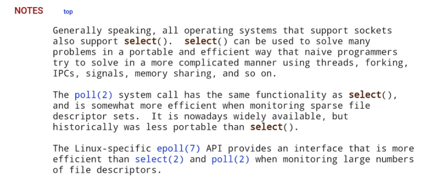

<center><i>Image 1: useful notes in select\_tut(2)</i></center>

### MQTT Implementation

**The E-poll (epoll) Facility**

- A: interest list (of file descriptors, virtually network sockets)  
- B: ready list

Note that B is a subset of A.

**Advantages of `epoll_wait()`**


*Figure 3-1: illustration of actual usage of `epoll_wait()`*  
By introducing `epoll_wait()`, you can handle MQTT events all at once in an application event loop and release CPU (sleep) rather than scattering it everywhere in the loop.

### Callback Functions

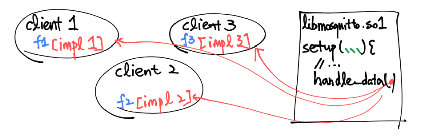

*Figure 4: callback in practice*  
As shown in Figure 4, some functions in a client, “callback function” for example, may never be called in its own codebase. These functions are left for the main program to call. It’s called “callback” functions for a reason\!

### Design vs. Implementation

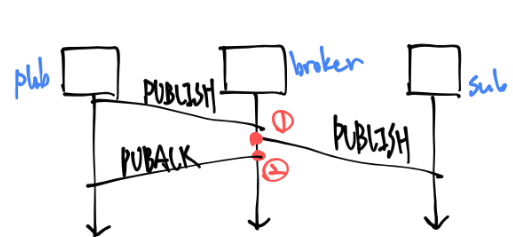

*Figure 5: a scenario where the MQTT QoS 1 design doesn’t specify the broker’s behavior*  
It’s acceptable for the broker both to send PUBACK or forward PUBLISH first. It’s not that MQTT has missed something, but it’s not important in the design aspect, so the designers leave the right to choose between them to whomever implements it.

1. for those who want to decrease latency  
2. for those who want to mitigate broker loading

## Week 3: Diving Into Mosquitto, a C Implementation of MQTT

There are some notable patterns in Mosquitto. Understanding them helps us to customize it and write our own feature patches onto it.

### Platform-specific Implementation

By using if-else macros, we can include special behaviors for a specific setup **in compile time**.

For example, the filesystem path syntaxes for DOS systems and UNIX systems are different. We may want to implement path-related code separately.

```c
    // do something  
#ifdef WIN32  
    // do something only when we are using Windows  
#endif  
```

```c
#ifdef WITH_EPOLL  
    // use epoll mechanism  
#else  
    // use poll mechanism  
```

### Main Event Loop

We define an external variabe to perform as a "flag." The loop runs repeatedly until in some functions it is set as a stop signal.

```c
// src/loop.c

extern int run;
// ...
// line 190
while (run) { 
	// … 
}  
```

## Week 3: The MQTT Protocol and QoS

### QoS 2: Exactly-once Delivery

In cases such as making purchases, sending launch codes, or transferring money, sending that more than one time causes critical impact. The goal of QoS-2 is to deal with such problems by eliminating duplicated messages.  

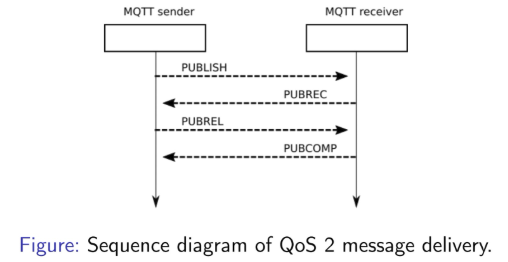

**3 KEY CHALLENGES**

- How do a receiver identify a duplicated message?  
- When can a sender stop sending duplication?  
- When can a sender recycle the assignment of a packet identifier?

Useful idea: When a sender receives `PUBCOMP`, it means that “the whole delivery has ended.” 

### QoS Consolidation

**Specification of QoS Usage (Which Level to Use)**  

*See MQTT v5 spec., Sec. 3.8.4*

1. The one that a subscriber requests (i.e. can afford)  
2. The one that the broker can use to deliver  
3. The one used in actual message delivery

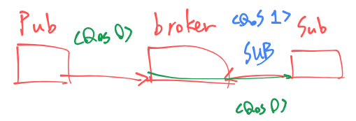
<center><i>Case 1</i></center>
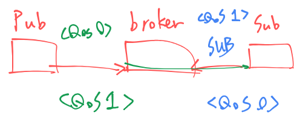

<center><i>Case 2</i></center>

### Request/response Using MQTT

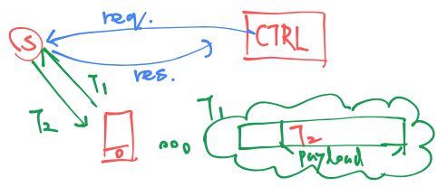

<center><i>Figure A: a special method to deal with additional publisher or subscriber</i></center>

## Week 4: Evaluating a Data Communication System
### Outline

- Evaluating a data communication system  
  - throughput: amount of data\[bits\] sent per unit of time\[kbps\].  
  - delay  
- Time Synchronization  
  - NTP, Network Time Protocol: 1 to 2ms latency  
  - PTP, Precision Time Protocol: under 1ms latency

### Common Sense

Light speed: 300km / ms; distance from TW to LA: 10,000km.  
Theoretical latency of [`www.google.com`](http://www.google.com) accessing from Taiwan should be around 35ms accordingly. However, with our LAN proper enough, we can get lower than 10ms.

So what happened under the hood? Keyword: CDN, Cache

### Routing

- Routing algorithms  
- Network flow problem

Routing algorithms aim to solve **network flow problems** like “what is the possibly shortest path from sender to receiver in the network core?”. Studies of routing algorithms, without doubt, are very mature, and there are some decent tools about them. **However,** routing algorithms focus on relatively static systems; meanwhile, in the real world, routing systems in practice are very dynamic. For example, any node could be temporarily unreachable; also, it’s impossible for us to implement the theoretically optimal configuration for the real, complex system. We need a different model that is more flexible.

### Throughput and Delay

#### Introduction to the Idea of “Throughput”

Let’s take a look at a node.

<center><i>Figure: illustration of a node</i></center>

Throughput is somewhat related to delay. We can use water tube as an analogy:

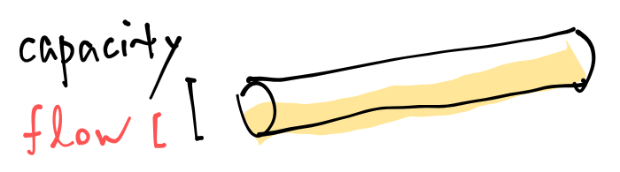
<center><i>Figure: an analogy</i></center>

When the bandwidth consumption of a node reaches its maximum bandwidth, delay should increase.

Now let’s take a look at a simple illustration of actual flow control mechanics.

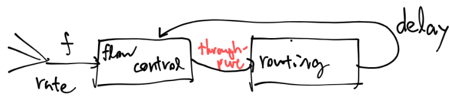
<center><i>Graph: flow control system</i></center>
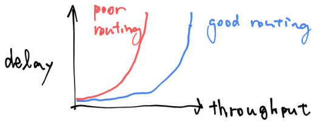
<center><i>Chart: throughput-delay relationship</i></center>

Since we want more throughput under the same delay, the blue curve in the chart shows better routing mechanics than the red one.

What we do here is to *characterize* how this system functions.

#### Throughput and Buffer of a Router

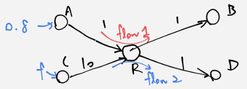

<center><i>Figure: a network system </i></center> 

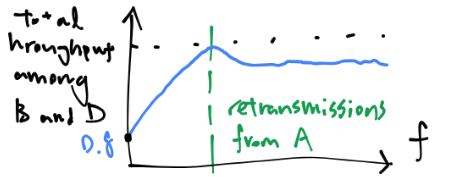

<center><i>Figure A: total throughput (close, but not reaching 1.8)</i></center>

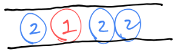

<center><i>Figure B: limited-size buffer of a router</i></center>

In figure A, we find that the throughput decreases. That is because after flow 2 exceeds the size of the buffer router R allocated for it, some of the packets from A to B drops.

### Measuring Latency

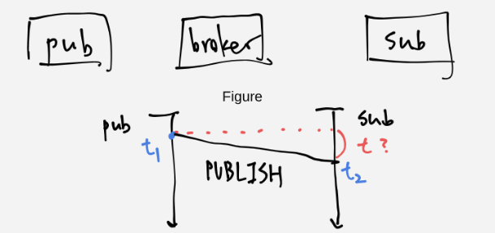
<center><i>Figure C</i></center> 

As shown in Figure C, we could put additional information, named timestamp, in the header of the packet.

However, the clocks in different machines could differ. In some cases, latency calculated by such a method will even be a negative value. Especially in many embedded systems, the machine doesn’t have batteries that keeps the internal clock up, so their clocks aren’t expected to be correct.

### NTP, Network Time Protocol

- shortest path spanning tree  
- Bellman-Ford minimum spanning tree

The reference clock is like the root of a tree. Using the shortest path spanning tree is meant to minimize the overhead.

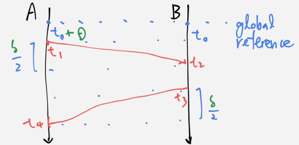
<center><i>Flow Chart: time synchronization in progress</i></center>

Symbols

- $\delta$: round-trip delay between A and B  
- $\theta$: time offset of B relative to A  
- Note that $t_{1}$ and $t_{4}$ are not absolute time but off-set (by $\theta$) timestamps marked by machine A.

$$
\delta = (t_{4} - t_{1}) - (t_{3} - t_{2})
$$

Representing $t_{2}$ and $t_{3}$ as functions of $\theta$ and $\delta$:

$$
\left\{\begin{aligned}
 & t_{2} = t_{1} - \theta + \frac{\delta}{2} \\
 & t_{3} = t_{4} - \theta - \frac{\delta}{2} & 
\end{aligned}\right.
$$

Solve them as a system of equations:  

$$
\theta = \frac{1}{2} ( (t_{2} - t_{1}) + t_{3} - t_{4})
$$

#### Downsides of NTP

After all the hustles we had in NTP, we still have 1 to 2 milliseconds of synchronization error.

1. Time spans from t1 to t2 and t3 to t4 are assumed to be the same, but it is not true.  
2. Internal clocks inside the machines also have latencies. For example, the NTP program may be preamped by the system due to the emergence of other programs with higher priority.  
3. If the data is retransmitted in the TCP layer, the time span from t1 to t2 and that from t3 to t4 is not *delta* / 2 even in theory.

*Lessons here: if you want to spot problems in your theory, you need to have proper knowledge of many aspects involved.*

### PTP, Precision Time Protocol

p.d.f, probability density function

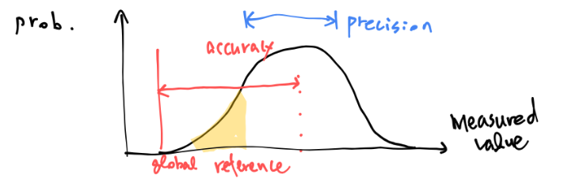

<center><i>Chart: probability density function</i></center>

Note that precision and accuracy are two different ideas.  
PTP aims to reduce *jitters*. Jitters are time variations that exist in data transfer in practice.  
The key idea of PTP is: if a PTP-supported switch has some latency, it will attach additional messages to tell receivers to take its exact latency value into calculation.

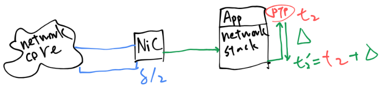
<center><i>Figure: internal latencies that produce jitters, and how we could deal with it</center></i:>