[課程總覽](../)

# Queueing Theory
## Week 5: The Queueing Model

- A Proof for The Queueing Formula: L \= lambda W.

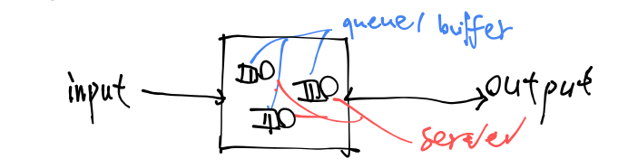

<i>Figure: Illustration of a Simple Queueing Model</i>

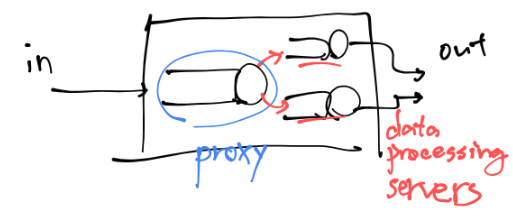

<i>Model of A Load Balancer</i>

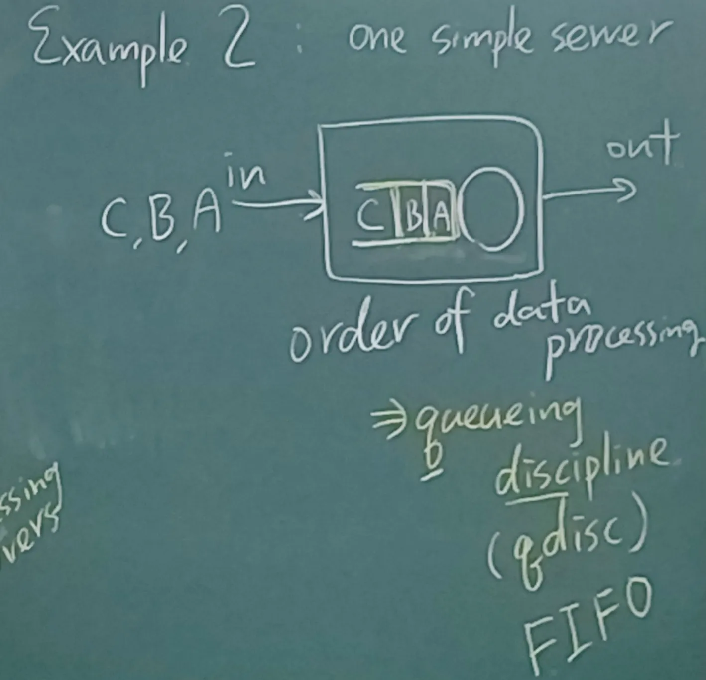

<i>A Simple Sewer</i>

This is the simplest implementation of the queueing model. All it has is just a conceptual server and a queue attached to it.

### Example 3

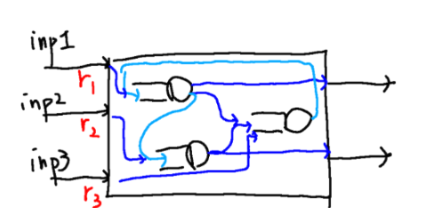

Note: ***r*** here stands for **rate**.

### Example 4

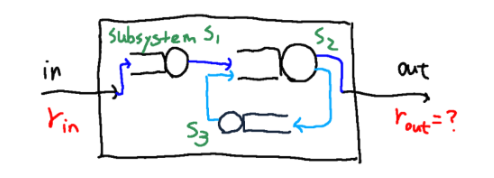

Requirement: in \> S1 \>S2 \> S3 \> S2 \> out

Imagine a processing line in a factory. S3 may be quality checkers to make sure that the product is okay before output.  
Here’s one advantage of the model. If we know the input rate and rates of every server, then it’s easy for us to analyse the output rate without being distracted by other aspects of the system.

### Analysing a Queueing System

For the simplest system in Example 2, we are curious about how long it will take from in to out.

#### Terminologies

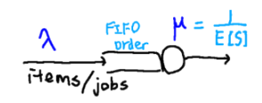

***mu***: mean service rate  
***lambda***: job size  
***X***: Throughput

As shown in the figure, the average service rate is determined by some actual data, supporting the idea that we actually determine the rate by performing some experiments on the system.  

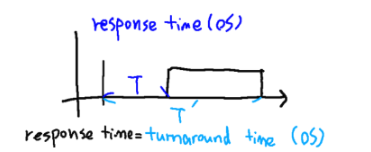

Note that the “response time” here is different from what it refers to in terms of operating system.

#### Performance Metrics

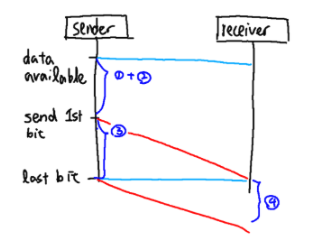

1. Processing Time  
2. Queueing Time  
3. Transmission Time  
4. Propagation Time
5. *Response Time / Latency (**T**)*  
6. *Throughput (**X**)*  
7. *Utilization   
8. *Propagation Time*

Propagation time means how long it will take to send one single bit.

#### Utilization Law

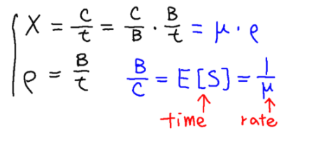

*Proof: throughput (X) \= average service rate (mu) x utilization (rho)*

***B***: amount of time the system is busy  
***C***: amount of items the system processed.  
***T***: how long the users will actually wait, effectively determining the user experience.

Let’s consider that if the arrival rate (lambda) becomes twice as much, but the response time needs to keep the same, how fast should the mean response time (mu) be?  

*should the new mean service rate be **2-mu**?*  
Note that we usually have an implicit assumption: the system is not overwhelmed; statistically, output rate is \~eq to input rate, i.e. X \~= lambda.  
**ANALOGY**: “mu” is like capacity; “X” is like the actual bandwidth.  
Therefore the new m.s.r. **does not necessarily** be twice as much as the original value.  

*Figure: Analysing the system provided in Example 4\.*

### Little’s Law

E\[N\] \= lambda E\[T\]  
***lambda***: arrival rate  
***T***: response time  
***N***: amount of data in system  
Usage 1: we can calculate the response time of a system by monitoring the other two metrics.  
Usage 2 (analogy): 餐廳：如果知道客戶量跟翻桌率，則可以計算需要的座位數量  
Usage 3 (analogy): 碩博實驗室：目前有幾個 / 一年收幾個 \= 每個人待的時間

#### Derivation

***N(t)***: amount of items in the system at ***t***.  
***alpha(t)***: amount of items arrived in interval \[0, ***t***\]  
***beta(t)**:* amount of items departed in \[0, ***t***\]  
***T\_i***: response time of the ***i***\-th arriving item.  

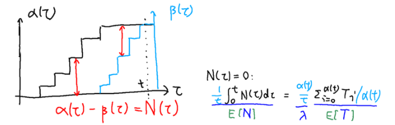

*Graph: Derivation Details*  

**

## Week 6: The M/M/1 System and the Markov Chain

### The M/M/1 System

M: Interarrival time follows exponential distribution.

M: Service time follows exponential distribution.

1: There’s only one server.

The Kendall notation

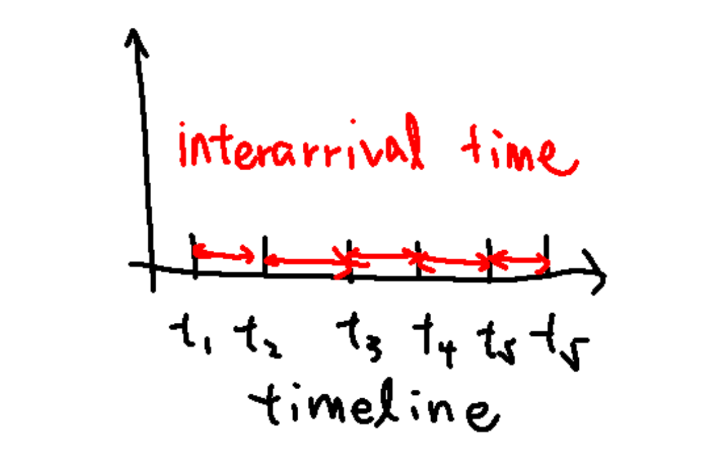

Figure: Interarrival Time Distribution.

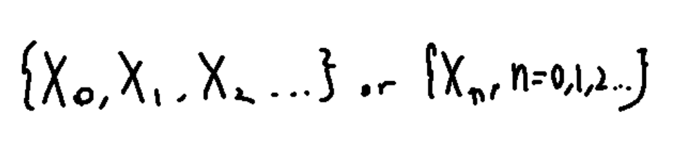

States of Each (Discrete) Time.

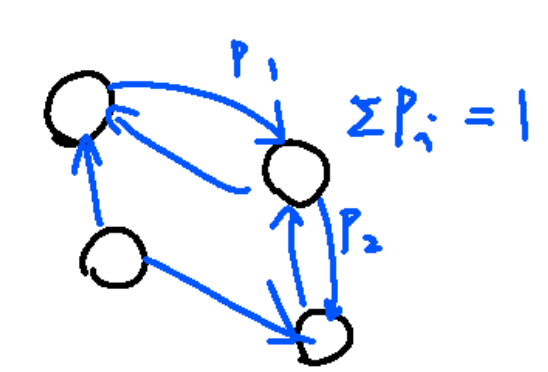

State Machine and Probabilities of Transition.

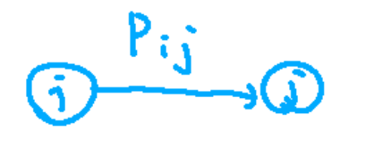

A probability of transition is denoted as P_ij.

  

The Markovian Property: The conditional distribution of any future state is independent of past states and only depends on the present state.

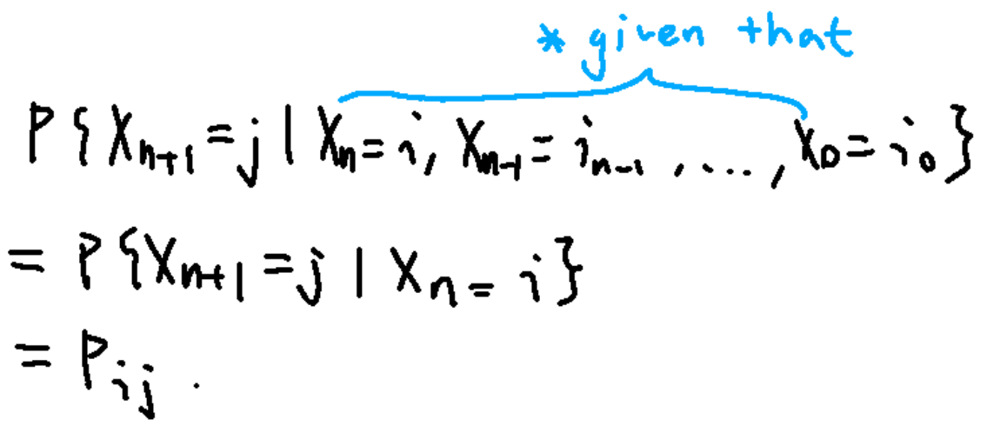

Definition of the Markovian property.

  

(!) Linear Time-invariant, LTI

It makes it easier to analyze the system to assume the system is LTI.

### Transition probability Matrix

Diving into how the states transit.

It turns out that matrix multiplications describe such transitions pretty well.

  

Note that it’s “轉移矩陣” in Chinese. It’s taught in math class in senior high, especially about the systems that only have two states.

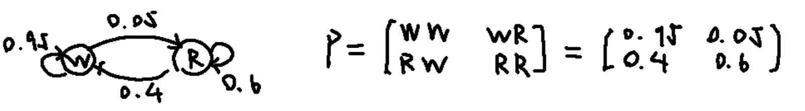

  

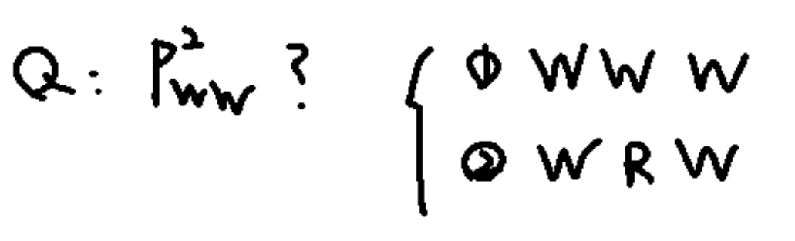

Since we have the Markovian Property, every event is independent of each other. Therefore, the probability of a series of events is the product of the transformation matrix of each of them.

  

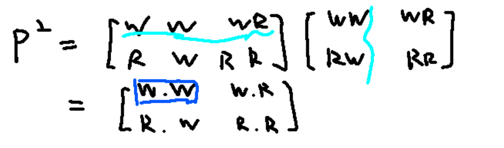

This is also taught in senior high.

### Limiting Distribution

P_inf = lim(n->infinity) P_n.

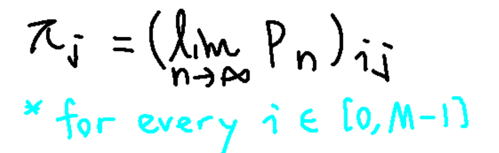

  
  

We have the special case of M=2.

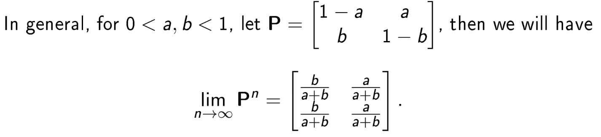

### Stationary Distribution

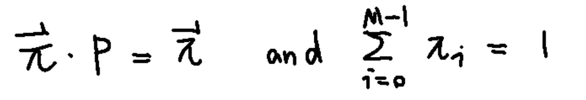

pi_n: The probability of a system to transit to state n.

  

### Binomial Distribution

Bernoulli trials b(k; n, p)

k: amount of successes

n: amount of trails

p: probability that the trial successes.

  

C(n,k) p^k q^(n-k)

  

### Poisson Distribution

It’s a nice approximation since exponentiation has some nice properties.

  

lambda’: the sharp symbol is here just to distinguish it from another lambda later.

  

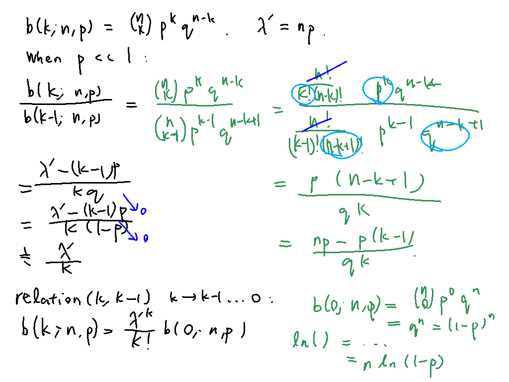

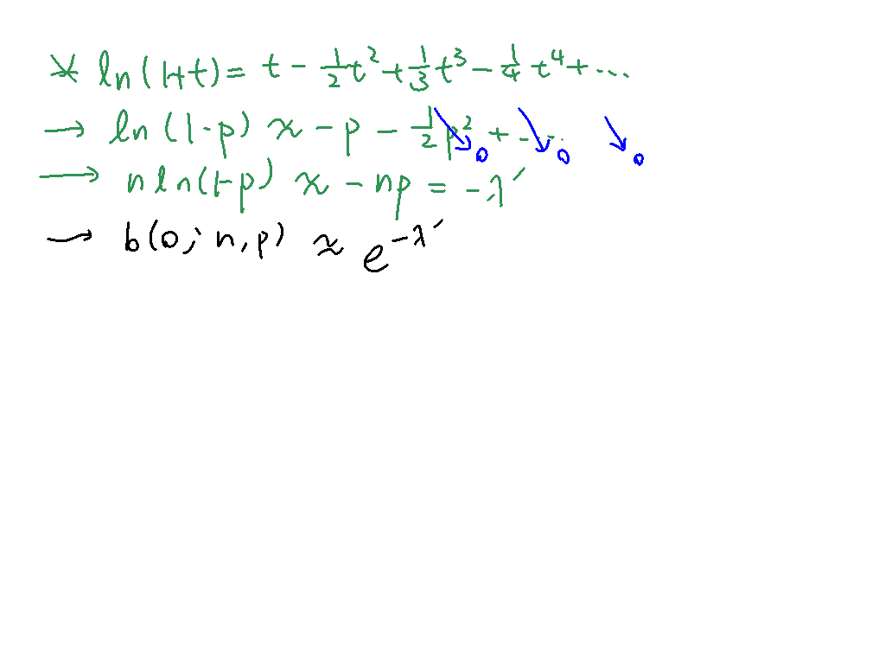

Proof.

  

### Exponential Distribution

### Poisson Process

Independent increment - number of arrivals in disjoint time intervals are independent

Stationary increment - number of arrivals in any intervals of length tao is Poisson distributed with parameter lambda tao.

(distributions: stationary, limiting, binomial & poisson, exponential); poisson process; markov chain; CTMC
### Distributions
#### Transition Matrix
Transition Probability Matrix
$$
\begin{bmatrix}
0.7 & 0.3 \\
0.8 & 0.2
\end{bmatrix}
$$
Transform Probability from state $s_{1}$ to state $s_{2}$ 
$$
P_{s_{1}s_{2}}
$$

#### Notation
A probability distribution
$$
\vec{\pi} = (\pi_{0}, \pi_{1}, \dots)
$$
#### Stationary Distribution
Stationary Distrbution with Transition Probability Matrix $\mathbf{P}$ and Probability Distribution $\vec{\pi}=(\pi_{0}, \pi_{1}, \dots, \pi_{M - 1})$

$$
\vec{\pi} \cdot \mathbf{P} =  \vec{\pi} \ \land \ \sum ^{M - 1}_{i = 0}  \pi_{i} = 1
$$
#### Limiting Distribution
Limiting Distribution
$$
P_{\text{inf}} = \lim_{ n \to \infty } P_{n}
$$
If the state machine follows the limiting distribution, then for any $i$ other than $j$, the probability to transform from state $i$ to state $j$ follows
$$
\pi_{j} = (P_{\text{inf}})_{ij}
$$

#### (Recall) Binomial Distribution
Bernouli Trials
$$
P\{ S_{n} = k \} = b(k; n, p)
$$
- $k$: amount of sucesses
- $n$: amount of trials
- $p$: probability of sucess of single event
- $S_{n}$: random variable that represents Bernouli trial with $n$ trials

Probability Evaluation
$$
b(k; n, p) = C^{n}_{k} p^{k} q^{n - k}
$$
#### Poisson Distribution
Poisson Distribution
$$
p(k; \lambda') = \frac{\lambda' ^{k}}{k!} \cdot e^{- \lambda'}
$$
- $k$: amount of successes
- $\lambda'$: rate

Derivation
Let $\lambda' = n \cdot p$.
When $n$ is very large and $p$ is very small,
$$
b(k; n, p) \simeq \frac{\lambda'^{k}}{k!} e^{-\lambda'}.
$$
Then we define such approximated relationship as Poisson distribution.

*The proof is not yet here.*

#### Exponential Distribution
P.D.F. $f(x)$ is defined:
$$
f(x) = \left\{\begin{aligned}
 & \lambda e ^{\lambda x}   & & \text{if} \ x \ge 0\\
 & 0  & & \text{otherwise}
\end{aligned}\right.
$$
C.D.F. $F(x)$ can be derived:
$$
F(s) = P\{ X \le x \} = \int ^{x}_{-\infty} f(x) \ \text{d}x = 1 - e^{-\lambda s}
$$
We take the compliment of the above relationship ($P{\{ X \le x \}} \to P\{ X>x \}$):
$$
P\{ X > x \} = e^{-\lambda s}
$$
Expected Value of Random Variable $X$:
$$
\mathbf{E}[X] = \int ^{\infty}_{-\infty} x f(x) \ \text{d}x = \frac{1}{\lambda}
$$
Theorem. If $X$ follows the exponential distribution, then
$$
P\{ X > s + t \ | \ X > s \} = P\{ X > t \}.
$$

**Proof**.

Left =
$$
\frac{P\{ X > s + t \}}{P\{ X > s \}} = \frac{e^{-\lambda(s + t)}}{e^{-\lambda s}} = e^{\lambda t}
$$
= Right. $\blacksquare$

### Poisson Process
#### Terms
- Poisson process is a stochastic process
- Poisson process follows the Poisson distribution
- $A(t)$: amount of arrivals in time interval $[0, t]$
	- Naturally, $A(0) = 0$
- $\lambda$: rate

Following the Poisson distribution:
$$
P\{ A(t + \tau) - A(t) = k \} = p(k; \lambda \tau)
$$
and it evaluates to
$$
e^{-\lambda \tau} \frac{(\lambda \tau)^{k}}{k!}
$$
#### Properties
- Property 1: the interarrival times of a Poisson process are independent and exponentially distributed with rate $\lambda$.
- Property 2: if two or more independent Poisson processes $A_{1},\dots, A_{n}$ are merged into a single process $A = A_{1} + A_{2} + \dots + A_{n}$, then $A$ is a Poisson process with a rate equal to the sum of the rates of Ai for $i = 1\dots n$.

### Markov Chain

#### Markovian Property and DTMC
The Markovian Property: The next state $X_{n + 1}$ from present only depends on the present state $X_{n}$, or
$$
\begin{aligned}
&P \{ X_{n + 1} = j \ | \ X_{n} = i, X_{n - 1} = i_{n - 1}, \dots, X_{1} = i_{1}, X_{0} = i_{0} \} \\
 & = P \{ X_{n +1 } = j \ | \  X_{n} = i \}.
\end{aligned}
$$
We denote the transition probability in DTMC by
$$
P_{ij} = P \{ N_{k + 1} =j\ | \ N_{k}= i\}
$$

DTMC is a stochastic (aka random) process that satisfies the Markovian property.

*(Keyword?) Linear Time-Invariant*

### CTMC
#### Definition
$N(t)$: numbers of messages in system at time $t$
CTMC: 
$$
\{ N(t)\ | \ t > 0 \}
$$

### Diving into M/M/1
#### The M/M/1 System
The Kendall Notation: a X/Y/Z queueing system
- X: the distribution of interarrival times for the arrival process
- Y: the distribution of the service time
- Z: the number of servers

1. Arrival Statistics (X = M)
	- Data arrives according to the **Poisson process** with rate $\lambda$. 
	- The interarrival times follow an **exponential distribution**.
2. Service Statistics (Y = M): The data service times follow an **exponential distribution** with rate $\mu$.
With 1. and 2., the number of data items in the next moment will only depend on the current **number of data items** in the systems.

Thus, to analyze the probability for a system to have $N$ data items, here we can apply theory of Markov chain.

#### Applying Theory of Markov Chain
Take CTMC with $N(t)$. We start from DTMC and then derive to CTMC.
Consider time points
$$
0, \delta, 2\delta, \dots,
$$
and let
$$
N_{k} = N(k \delta)
$$
denote the number of messages in the system at moment $k\delta$.
Then,
$$
\{ N_{k} \ | \ k = 0, 1, \dots \}
$$
is a DTMC.
Then apply $\delta \to 0$ (limit) to derive to CTMC.

$$
P_{ij} = \{  N_{k + 1} = j \ | \ N_{k} = i \}
$$
$$
= \{ N((k + 1) \delta) = j \ | \ N(k\delta) = i \}
$$
$$
= \{  \}
$$

#### The Arrival/Service Statistics for M/M/1
1. Messages arrival ~ Poisson process ($A(t)$)
2. Interarrival times ~ Exponential Distribution ($\lambda$)

- $\tau_{n}$: $n$-th to $n+1$-th

$$
P\{ \tau_{n} \le \delta \} = 1  - e^{-\lambda\delta}
$$
See [[#Poisson Process]].

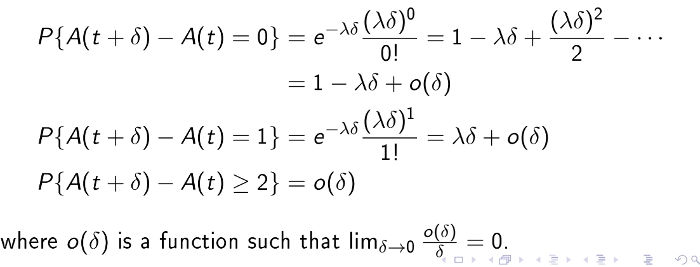
Determining $P_{ij}$: (TODO)
$$
P_{ij} = \{ N_{k + 1} = j \ | \ N_{k} = i\}
$$
$$
= \{ N \}
$$  

## Week 8: The Aloha System

### Initial Story

- Centralized System: Multiple Sender, One Receiver
    
- RF Communication
    
- Concept of “Time Slot”
	- the fact that messages received in the same time slot “collides” and are invalid.
    

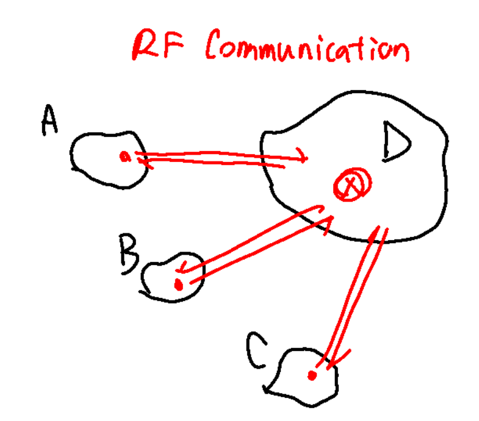

One way to prevent collision is TDMA, Time Division Multiple Access.

But here comes the down side. 

- What if one specific sender has so many messages to send?
    
- If we have m senders, the average waiting time is about m/2.
    

  

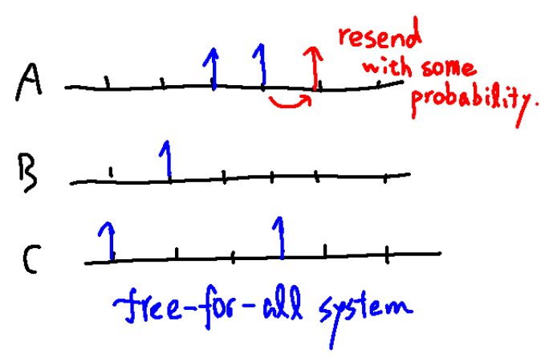

Key factors of efficiency of the aloha system

- rate of transmission
    
- rate of re-transmission
    
- amount of senders
    

e.g. if the rate of transmission is high, then it’s more likely to collide, then it’s more likely to re-transmit too.

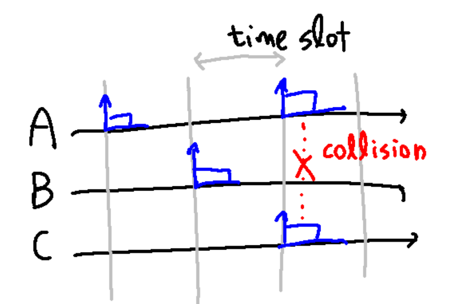

Note that we can apply the queueing model here!
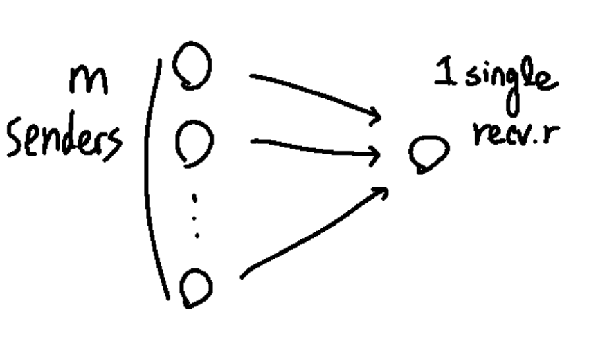

However, since the existence of re-transmission, the situation is kind of complicated. We will break it into two models, ones describing the worst and the best cases.

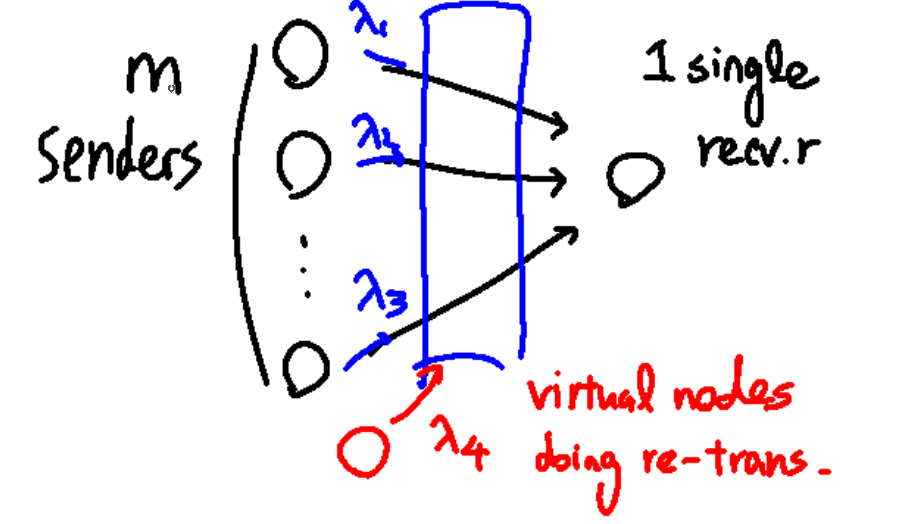

We view re-transmissions as separate nodes.

1. Worst-case assumption (m -> infinity)
    
2. Best-case assumption (no buffering)

The backlogged node, the node that is experiencing collision.

We use the Markov chain here, labeling each state with numbers of “the backlogged nodes”.

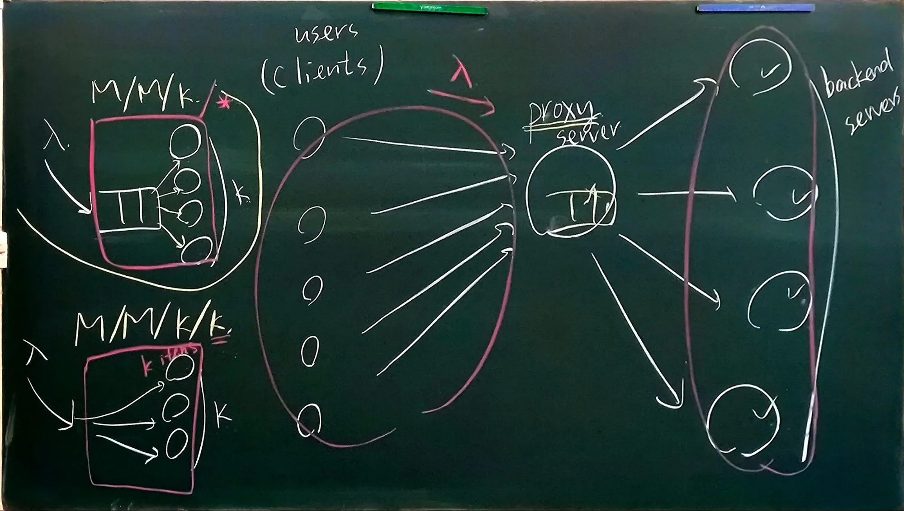

$$
X_{i} \sim \text{Exp} (v_{i} p_{i j})
$$

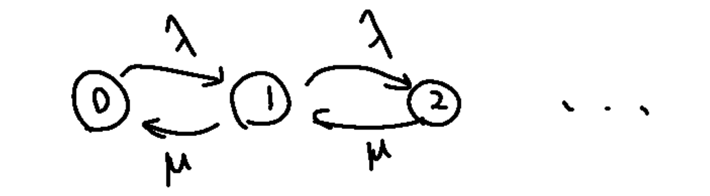

## Week 9: Beyond Queueing Systems
### Analyzing M/M/k/k
The CTMC for a M/M/k/k is a **birth-death process**:

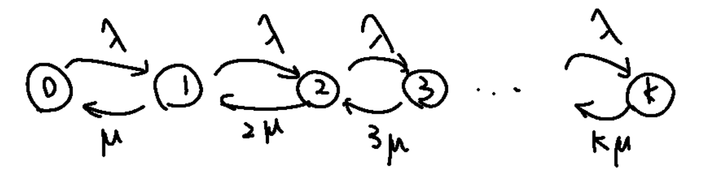

At one moment there is at most one departure and one arrival.

Here $\pi_{i}$ means the **steady-state probability** that the system has $i$ items.

(WIP)

$$
\begin{array}. \text{Time-reversibility equation}  &  \text{Simplified equation}\\
 \pi_{0} \lambda = \pi \mu  & \pi_{1} = \frac{\lambda}{\mu}  \pi_{0} \\
\pi_{1}\lambda = \pi_{2} 2 \mu  & \pi_{2} = \left( \frac{\lambda}{\mu} \right)^2 \frac{1}{2!} \pi_{0} \\
\dots \\
\pi_{k - 1} \lambda = \pi_{k} k \mu  & \pi_{k} \left( \frac{\lambda}{\mu} \right) ^{k} \frac{1}{k!} \pi_{0}
\end{array}
$$

Here,

$$
\pi_{i-1} \lambda = \pi_{i} i \mu
$$
means the "flow" from state $i - 1$ must equals that from state $i$, which is supported by the fact that (...)

$$
\sum ^{\infty}_{i = 1} i \cdot (G\dots) = \sum ^{\infty}_{i = 1} i \cdot (D \dots)
$$
- Global Balance Equation -> Balance Equation
- Detailed Balance Equation -> Time Reversibility Equation

With this, we are able to acquire $\pi_{i}$.

$$
\pi_{i} = \frac{\left( \frac{\lambda}{\mu} \right)^{i} / i!}{\sum ^{k}_{j = 0} \left( \frac{\lambda}{\mu} \right)^{j} \frac{1}{j!}}
$$
for $1 \le i \le k$. (**Erlang-B Formula**)

Blocking probability, $P_{\text{block}}$
$$
P_{\text{block}} = \frac{P \{ X = k \}}{P \{  X \le k \}}
$$
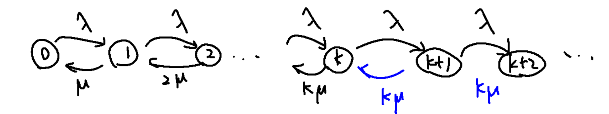

### Stationary Probabilities
(from about page 13:)
$$
\pi_i = \begin{cases}
\frac{(\lambda/\mu)^i}{i!} \pi_0 & \text{if } i \leq k \\
\frac{(\lambda/\mu)^i}{k! k^{i-k}} \pi_0 & \text{if } i > k
\end{cases}

$$

$$
\pi_0 = \left[ \sum_{i=0}^{k-1} \frac{(k\rho)^i}{i!} + \frac{(k\rho)^k}{k!(1-\rho)} \right]^{-1}
$$

#### Minimum Resource Requirement
We have
$$
\rho = \frac{\lambda}{k \mu}
$$
viewing from total service capacity, and
$$
\frac{\lambda / k}{\mu}
$$
viewing from each single server.

Here $\rho$ means utilization.

Expected number of busy servers, $R$, is acquired by
$$
R = \sum ^{k}_{i = 0} i \cdot P \{ i\ \text{jobs in service} \}.
$$

Probability for an arriving job to be queued, $P_{Q}$, can be described as that for the event when **an arrival finds all servers busy** and when **an arrival finds at least** $k$ **jobs in the system**. Then we have *Erlang-C formula* stating that
$$
\begin{aligned}

 P_{Q} &= \sum ^{\infty}_{i = } \pi_{i}\ (\text{by PASTA})\\  & = \frac{(k \rho)^{k} \pi_{0}}{k! (1 - p)}.
\end{aligned}
$$

$$
E[N_{Q}] = E[N_{Q} \ | \ \text{queueing}] \cdot P \{  \text{queueing} \} \dots
$$

## Week 9: Beyond Queueing Systems
$$
X_{i} \sim \text{Exp} (v_{i} p_{i j})
$$
  

### Analyzing M/M/k/k

The CTMC for a M/M/k/k is a **birth-death process**:

At one moment there is at most one departure and one arrival.

Here $\pi_{i}$ means the **steady-state probability** that the system has $i$ items.

$$
\begin{aligned}
\text{Time-reversibility equation}  &  \text{Simplified equation}\\
 \pi_{0} \lambda = \pi \mu  & \pi_{1} = \frac{\lambda}{\mu}  \pi_{0} \\
\pi_{1}\lambda = \pi_{2} 2 \mu  & \pi_{2} = \left( \frac{\lambda}{\mu} \right)^2 \frac{1}{2!} \pi_{0} \\
\dots \\
\pi_{k - 1} \lambda = \pi_{k} k \mu  & \pi_{k} \left( \frac{\lambda}{\mu} \right) ^{k} \frac{1}{k!} \pi_{0}
\end{aligned}
$$

Here,

$$
\pi_{i-1} \lambda = \pi_{i} i \mu
$$

means the "flow" from state $i - 1$ must equals that from state $i$, which is supported by the fact that (...)

---

$$
\sum ^{\infty}_{i = 1} i \cdot (G\dots) = \sum ^{\infty}_{i = 1} i \cdot (D \dots)
$$

- Global Balance Equation -> Balance Equation
- Detailed Balance Equation -> Time Reversibility Equation

With this, we are able to acquire $\pi_{i}$.

$$
\pi_{i} = \frac{\left( \frac{\lambda}{\mu} \right)^{i} / i!}{\sum ^{k}_{j = 0} \left( \frac{\lambda}{\mu} \right)^{j} \frac{1}{j!}}
$$

for $1 \le i \le k$. (**Erlang-B Formula**)

Blocking probability, $P_{\text{block}}$

$$
P_{\text{block}} = \frac{P \{ X = k \}}{P \{  X \le k \}}
$$

### Stationary Probabilities

(from about page 13:)

$$
\pi_i = \begin{cases}
\frac{(\lambda/\mu)^i}{i!} \pi_0 & \text{if } i \leq k \\
\frac{(\lambda/\mu)^i}{k! k^{i-k}} \pi_0 & \text{if } i > k
\end{cases}

$$

$$
\pi_0 = \left[ \sum_{i=0}^{k-1} \frac{(k\rho)^i}{i!} + \frac{(k\rho)^k}{k!(1-\rho)} \right]^{-1}
$$

**Minimum Resource Requirement**

We have

$$
\rho = \frac{\lambda}{k \mu}
$$

viewing from total service capacity, and

$$
\frac{\lambda / k}{\mu}
$$

viewing from each single server.

Here $\rho$ means utilization.

Expected number of busy servers, $R$, is acquired by

$$
R = \sum ^{k}_{i = 0} i \cdot P \{ i\ \text{jobs in service} \}.
$$

Probability for an arriving job to be queued, $P_{Q}$, can be described as that for the event when **an arrival finds all servers busy** and when **an arrival finds at least** $k$ **jobs in the system**. Then we have *Erlang-C formula* stating that

$$
\begin{aligned}
 P_{Q} &= \sum ^{\infty}_{i = } \pi_{i}\ (\text{by PASTA})\\  & = \frac{(k \rho)^{k} \pi_{0}}{k! (1 - p)}.
\end{aligned}
$$

$$
E[N_{Q}] = E[N_{Q} \ | \ \text{queueing}] \cdot P \{  \text{queueing} \} \dots
$$

## Week 10: Error Detection

1. Cyclic Redundant Check
2. Error Correction Code 

S(D): Polynomial for the information

C(D): Polynomial for the parity checks

X(D): Polynomial for the message sent

g(D): a generator polynomial

## Week 11: Tolerating Host Failures
### SPoF, Single Point of Failures
e.g.
$$
\text{publishers}\to  \cancel{\text{single server}} \to \text{subscribers}
$$

### Strategies
1. State Machine Approach, aka Active Replication
2. Primary Backup Approach, aka Passive Replication

### State Machine Approach
The key point is clients want to only
1. updates data for server
2. fetch data from server.
So we want to "mask failures."
Solution: Add more servers in the service.

---

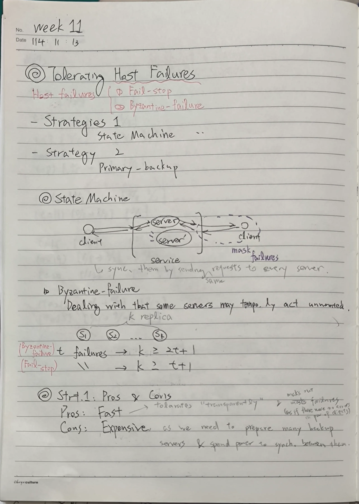

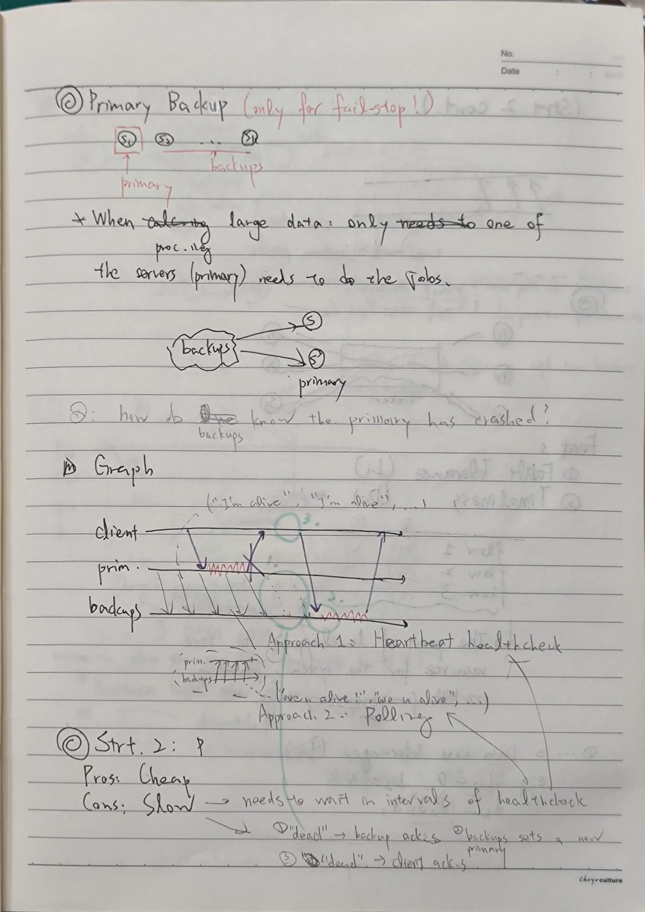

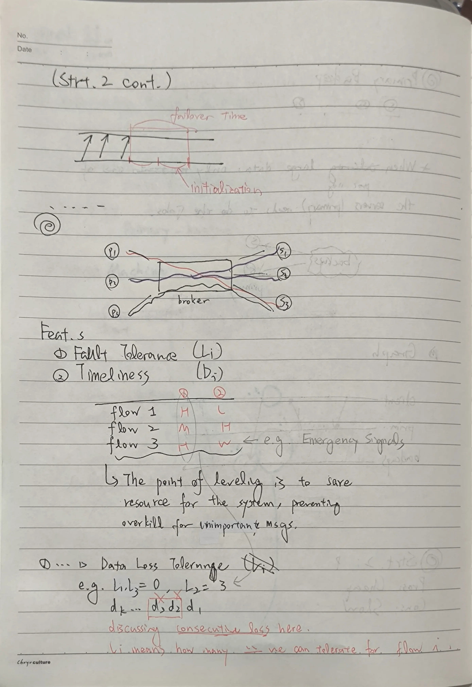
