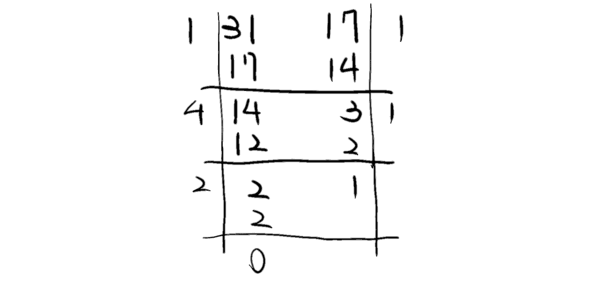

[課程總覽](../)
# Congruence
同餘是數論中很重要的一環。同餘關係的使用，代表我們討論的數學不再僅限整數、實數等無限長的域，而討論一個會「循環」的域。這一點在計算機中尤其重要。現代計算機的本質是位元操作，其在實際上總是只能代表「有限」的數字，這體現在「溢位」這個現象，而同餘關係很適合用來為這樣的系統建模。〔個人心得〕
## Compatibilities towards Basic Arithmetic
模運算適用許多基本運算，如加法、減法、同乘等等。

**Proposition**
$$
a\equiv b \,( \text{mod }m ) , c\equiv d \,( \text{mod }m ) \implies \left\{\begin{aligned}
(a+c)  & \equiv (b + d) \,( \text{mod }m ) & (1)  \\
a \cdot c  & \equiv b \cdot d \,( \text{mod }m ) & (2) 
\end{aligned}\right.
$$

**Proof(1)**
根據定義，$m$整除$a-b$跟$c-d$，因此我們可以設任意整數$k_{1},k_{2}$使得
$$
(a - b)=  k_{1} m ;(c- d) = k_{2} m.
$$
則我們可以將兩式合併，得${(a - b) + (c - d) = (k_{1} + k_{2})m}$，重新整理得${(a + c) - (b + d) = (k_{1} + k_{2})m}$，便符合同餘的定義。$\blacksquare$

**Proof(2)**
略，跟Proof(1)操作方式相似。$\square$

### Other Trivial Cases
模$(c\cdot m)$除以任意因數$c$，同餘式仍成立：
$$
a \equiv b \,( \text{mod } c\cdot m )  \implies a \equiv b \,( \text{mod } m )
$$

## Bezout's Identity
任意兩個數的**線性組合**必可以組出他們的最大公因數：
$$
(\forall a, b \ \exists x,y)\ a\cdot x + b \cdot y = \text{gcd}(a, b),
$$
而這個計算可以透過extended Euclidean algorithm求得。

## Extended Euclidean Algorithm
**Example** 找31, 17的線性組合。即解${31x + 17y = \text{gcd}(31, 17)}$。

首先用輾轉相除法，求得${\text{gcd}(31, 17)}$。其計算過程對於extended Euclidean是有幫助的。
$$
\begin{aligned}
31 &  = 17 \cdot 1 + 14 \\
17  & = 14 \cdot 1 + 3 \\
14  & = 3 \cdot 4 + 2 \\
3  & = 2 \cdot 1 + 1 \\
2 & = 1 \cdot 2 + 0
\end{aligned}
$$
若寫成直式就是：

---

得到算式與最大公因數後，接著執行extended Euclidean，有點像是「逆推」：
$$
\begin{aligned}
\text{gcd}(31, 17) & =1 \\
 & =3 - 2\cdot 1 \\
 & = 3 - (14 - 3 \cdot 4) \cdot 1  & &  = -14 + 3 \cdot 5 \\
 & = - 14 + (17 - 14 \cdot 1) \cdot 5   & & = 17\cdot 5 + 14 \cdot (-6) \\
 & = 17\cdot 5 + (31 - 17 \cdot 1) \cdot (-6)  &  & = 31 \cdot (-6) + 17 \cdot 11
\end{aligned}
$$
$\therefore$我們得到${x = -6, y = 11}$ $\blacksquare$

### Use Cases
我們可以利用extended Euclidean來求某些「同餘方程式」，比如：
$$
17 x = 8 ( \text{mod }31 )
$$
> 透過同餘的定義，我們知道$31$整除$17x - 8$，寫作${31 | (17x - 8)}$；再根據整除的定義，又可用一任意整數$k$，寫作${17x - 8 = 31k}$。
> 經過整理可得${17x + 31(-k) = 8}$，則此形式已經有點像是extended Euclidean可以處理的對象了。
> 然而，${\text{gcd}(17, 31) \ne 8}$，這個式子無法直接求解。*此路不通*。

根據前一小節舉例所得成果，已知${31\cdot (-6) + 17\cdot 11 = 1}$。重新寫成同餘式，則：
$$
17 \cdot 11 \equiv 1( \text{mod } 31 )
$$
根據同餘保持基本運算的特性，我們可以再度重寫同餘方程式（兩邊同乘）：
$$
17\cdot 8\cdot 11 \equiv 8( \text{mod }31 ) 
$$
故可以解得${x \equiv 88}$，取其最小正整數解${x = 26}$。$\blacksquare$

## Modular Multiplicative Inverse
對於一數$a$，若且唯若$a$與$m$互質，其模反元素$a^{-1}$存在。定義如下：
$$
\text{gcd}(a, m) = 1\Longleftrightarrow a^{-1}: a\cdot a^{-1} \equiv 1 \,( \text{mod }m ).
$$
由上可知反元素與所討論的域$\mathbb{Z}_{n}$有關。

### Proof by Bezout's Identity
設${d = \text{gcd}(a,m)}$。根據Bezout's identity，若$d = 1$，則存在$x,y$使得
$$
a\cdot x + m \cdot y = 1,
$$
因為以$m$為模，可以重寫為
$$
a\cdot x \equiv 1 \,( \text{mod }m ) .
$$
使用extended Euclidean algorithm便可求得$x$，而依據定義，$x$即為$a$的乘法反元素。
若$d\ne 1$，該數$a$不互質模$m$，則Bezout's identity不成立，$a^{-1}$不存在。
## Fermat's Little Theorem
Let $p$ be a prime. Then
$$
\forall a \in \mathbb{Z}, \text{gcd}(a, p) = 1 \implies a^{p - 1} \equiv 1 \ ( \text{mod } p ) .
$$
**Example** ${p= 3, a = 5}$
依照費馬小定理，可得${5^{3 - 1} = 25 \equiv 1\,( \text{mod } 3 )}$。
### Explanation with Abstract Algebra
乘法群${\mathbb{Z}_{p}}^{*}$的階為$p-1$，因此任意元素的$p-1$次方當然會回到單位元1。

### A Corollary
$$
a^{p} \equiv a \,( \text{mod } p ) .
$$
從費馬小定理的原方程式開始：
1. 如果$a$與$p$互質，則代表同餘式兩邊可以相乘$a$
2. 如果不互質，$p|a$，則${a^{p} \equiv 0 \equiv a \,( \text{mod } p )}$

# RSA
## Preprocessing
1. Choose 2 big prime numbers $p$ and $q$.
2. Choose a pair of numbers $e$ and $d$ such that
	1. $d\cdot e = 1(\text{mod}\ (p - 1)(q-1))$, when $e$ is public and $d$ is private.
3. Announce $(pq, e)$; keep $(p, q, d)$.
## Encryption and Decryption
Encrypting message $m$ as code $c$:
$$
c \equiv m^{e} (\text{mod}\ pq),\ m< pq, c < pq.
$$
Decrypting $c$ as $m$:
$$
m \equiv c^{d} (\text{mod}\ pq).
$$
## Verification
We set a symbol for the modulo:
$$
r := (p-1)(q - 1);
$$
also, for the product of two big primes:
$$
n:= p\cdot q,
$$
then we can describe the decrypting equations as $m \equiv c^{d}(\text{mod}\ n)$.

For the convenience of the proof, we set an arbitary number $k$ such that
$$
e \cdot d \equiv 1 (\text{mod}\ r) \implies r | (e\cdot d - 1) \implies  ed = 1 + kr.
$$
So that according to the proccess of encryption and decryption, we can say that
$$
c^{d} \equiv (m^{e})^{d} \equiv m^{(e\cdot d)} \equiv m^{1 + kr} (\text{mod}\ n),
$$
and in order to prove that this process really lead us to transfer the correct message, we need to check if
$$
c^{d} \equiv m^{ed} \equiv m^{1+kr} \equiv m (\text{mod}\ n).
$$
將式子重新整理，得：
$$
m\cdot m^{k(p-1)(q - 1)} \equiv m \,( \text{mod } pq )
$$
根據同餘保持基本運算的特性，兩邊同除$m$：
$$
m^{k(p - 1)(q - 1)} \equiv 1 \,( \text{mod }pq )
$$
$$
m^{k(p - 1)(q - 1)} \equiv 1\ \,( \text{mod } pq ) 
$$
### Verification Practice
> 如果縮減模，得${(m^{k(q - 1)})^{p - 1} \equiv 1 \,( \text{mod } p )}$，則依照費馬小定理便可得解。
> 但是${\text{gcd}(m,p) \underset{?}{=} 1}$，條件沒有說。*此路不通*。

**分項討論**
- Case 1: ${\text{gcd}(m,p) = 1 \land \text{gcd}(m, q) = 1}$
- Case 2: ${\text{gcd}(m, p) \ne 1 \underline{\lor} \text{gcd}(m, q) \ne 1}$

> ${\text{gcd}(m,p) \ne 1 \land \text{gcd}(m, q) \ne 1}$必然不成立：
> 如果成立，則${pq | m}$，存在正整數$k'$使得${m = kpq}$（因為$m > 0$）。
> 但RSA的前提已經表明${m < pq}$，故不成立。

**Case 1**
根據費馬定理，
$$
m^{p - 1} \equiv 1 \,( \text{mod } p ) \land m^{q - 1} \equiv 1 \,( \text{mod } q )
$$
則依基本運算可輕易得${m^{k(p-1)(q-1)} \equiv 1 \,( \text{mod } pq )}$

**Case 2**
先以$p$討論：
已知$m,p$不互質，則依照Case 2的假設，${\text{gcd}(m,q) = 1}$（或者$m=0$，不討論）。

因為$m$為$p$的倍數，則$m$的任意乘冪皆為$p$的倍數，即
$$
m^{1 + k (p - 1)(q - 1)} \equiv m \,( \text{mod } p ),
$$
則兩者同餘，${m \equiv m^{k(p - 1)(q - 1)} \,( \text{mod } p )}$。

又依據費馬定理，
$$
m^{q - 1} \equiv 1 \,( \text{mod } q )
$$
則可推知
$$
{m^{k(p-1)(q-1)} \equiv 1 \,( \text{mod } q )}.
$$
兩邊相乘$m$即得${m^{1 + k(p - 1)(q - 1)} \equiv m\,( \text{mod } q )}$。

統整得
$$
\left\{\begin{aligned}
 & m^{1 + k(p - 1)(q - 1)} \equiv m \,( \text{mod } p )  \\
 & m^{1 + k(p - 1)(q-1)} \equiv m \,( \text{mod } q ) 
\end{aligned}\right. \implies m^{1 + k(p - 1)(q - 1)} \equiv m \,( \text{mod } pq ) .
$$
故得證 $\blacksquare$

# Chinese Remainder Theorem
今有比1大且兩兩互質的正整數${m_{1},m_{2},m_{3},\dots m_{n}}$與任意整數${a_{1},a_{2},a_{3},\dots,a_{n}}$。則聯立同餘方程組
$$
\forall i \in \mathbb{N}_{n}\ x \equiv a_{i} \,( \text{mod } m_{i} )
$$
模${m_{1}\cdot m_{2}\cdot (\dots) \cdot m_{n}}$時有唯一解
$$
x = \sum ^{n}_{i = 1} a_{i} \cdot y_{i} \cdot M_{i},
$$
其中$y_{i}$為${M_{i} = \frac{m}{m_{i}}}$的模反元素${(M_{i})^{-1}}$。
白話翻譯：
該總和式，在模**所有同餘模相乘**時有唯一解；而y_i則是在**該行的模m_i**，取M_i的逆元。

## Proposition: Modulo Factorization
對於兩個互質的模$m_{1}, m_{2}$：
1. 同餘方程$\left\{\begin{aligned}x\equiv a_{1} \,( \text{mod }m_{1} )\\ x\equiv a_{2} \,( \text{mod } m_{2} )\end{aligned}\right.$有解
2. 任兩解都會同餘模$m_{1} \cdot m_{2}$。
> 或者說，對於整數環$\mathbb{Z}_{m_{1}\cdot m_{2}}$會有唯一解。

### Proof
$$
\text{If}\ t \equiv m_{1}^{-1}(a_{2} - a_{1}) \,( \text{mod }m_{2} ) ,\ \ \text{then} \ \ x = a_{1} + m_{1} t\ \text{is such a solution.}\ \blacksquare
$$

## Uniqueness Proof
假設有兩數$x_{1},x_{2}$均為同餘方程式之解。則對於所有方程式都存在商數$r_{i}, r'_{i}$使得
$$
x_{1} = r_{i}\cdot m_{i} + a_{i} \ \ \  \text{and}\ \ \ x_{2} = r'_{i} \cdot m_{i} + a_{i}
$$
兩數相減得${x_{1} - x_{2} = (r_{i} - r'_{i})\cdot m_{i}}$，則${m_{i} | (x_{1} - x_{2})}$，即
$$
x_{1} \equiv x_{2} \,( \text{mod } m_{1} \cdot m_{2} \cdot (\dots)\cdot m_{n} ),
$$
故知兩數模${m_{1}\cdot m_{2}\cdot (\dots)\cdot m_{n}}$時有唯一解 $\blacksquare$

## Proof of C.R.T.
設${m = m_{1} \cdot m_{2} \cdot (\dots) \cdot m_{n}}$，並設$M_{i} = \frac{m}{m_{i}}$。
> $M_{i}$的語意為「除了${m_{i}}$以外的所有模」

因為$m_{i}$兩兩互質，對於任意$k \ne i$，${\text{gcd}(m_{k}, m_{i}) = 1}$，據此得
$$
\text{gcd}(M_{i}, m_{i}) = 1.
$$
> $M_{i}$與$m_{i}$互質

則依模反元素的定義，存在$y_{i}$使得
$$
M_{i} \cdot y_{i} \equiv 1 \,( \text{mod } m_{i} ) ,
$$
或寫作${y_{i} = {M_{i}}^{-1}}$。
假設${x = \sum ^{n}_{i = 1}a_{i}\cdot y_{i} \cdot M_{i}}$為解。
根據定義可知，對於任意${j \ne i}$，$M_{j}$均可被${m_{i}}$整除，即
$$
M_{j} \equiv 0 \,( \text{mod }m_{i} ).
$$
故對於所有$i$，
$$
x \equiv a_{i} \cdot y_{i} \cdot M_{i} \equiv a_{i} \,( \text{mod } m_{i} )
$$
均成立，符合方程組之敘述，故假說成立 $\blacksquare$
> $M_{j}=0$的說明旨在提示$x$的其他所有加法項都會「消去」，只剩下第$i$項。