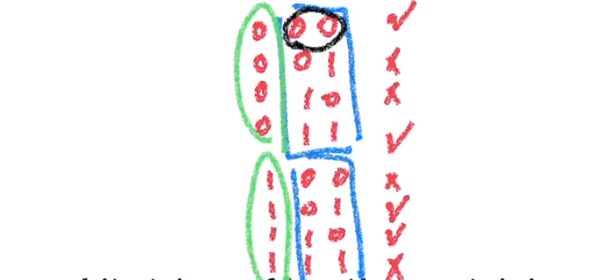
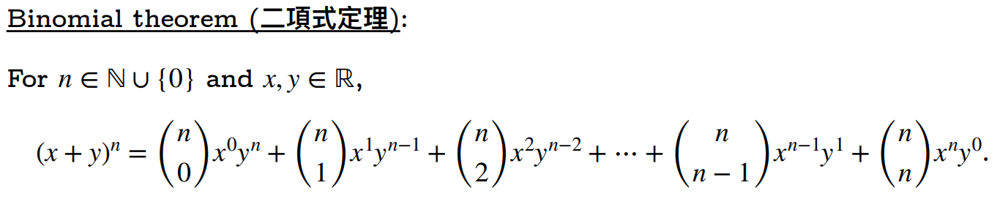
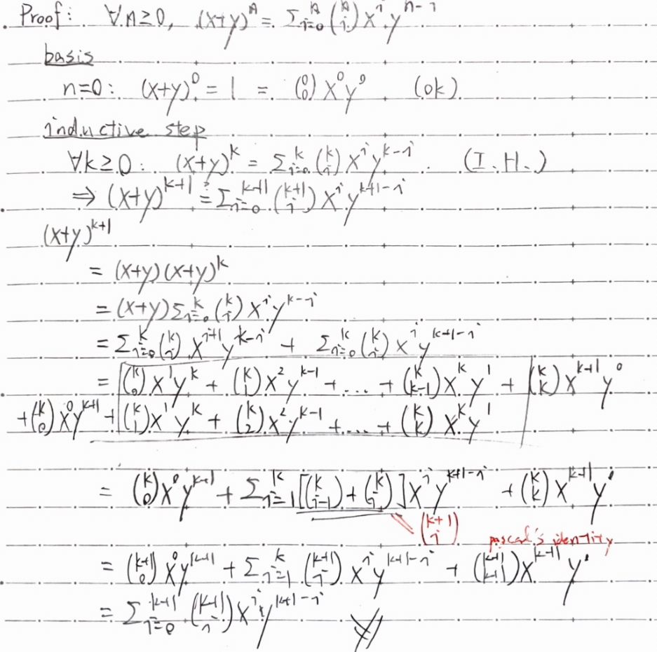

[課程總覽](../)
## Permutations
- 動機：想要知道程式需要跑多久
- 暴力窮舉，試算需要跑多少次程式才會停機 -> 運用counting相關技巧
$$
P(n, r) = P^{n}_{r} = \frac{n!}{(n - r)!}
$$
### 原理
- 第一個位置有n個可能，第二個位置有n-1個可能...
## Combinations
$$
C(n, r) = \begin{pmatrix} n \\ r \end{pmatrix} = \frac{P(n, r)}{r!} = \frac{n!}{r!(n - r)!}
$$
**重要性質**
$$
\begin{pmatrix} n \\ r \end{pmatrix}  = \begin{pmatrix} n \\ n-r \end{pmatrix}
$$
## Double Counting: An Example
### Bit Strings

> How many bit strings of length $n$ containing an even number of 1s are there?

每在前面加一位，就剛好增值奇數一倍、偶數一倍。所以加一位永遠還是偶數。

## 二項式定理
**Binomial Theorem**

### Pascal's Identity

$$
\begin{pmatrix} n \\ k \end{pmatrix}  = \begin{pmatrix} n - 1 \\ k - 1 \end{pmatrix} + \begin{pmatrix} n - 1 \\ k \end{pmatrix}
$$

解讀：
取$k$個東西，可以二分為「第一個取」跟「第一個不取」兩種情況。第一個情況中，你還需要取$k-1$個東西；第二個情況則還需要取$k$個。

### 證明

