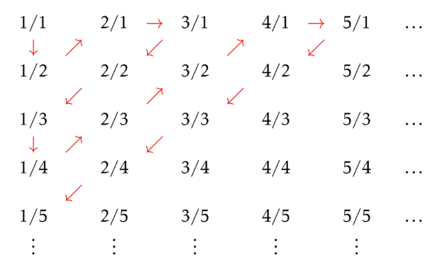

[課程總覽](../)
### Cardinality
Notation.
$$
\left| S \right|
$$

### Function
Notation.
$$
f: S \to T
$$

### Injection, Surjection, Bijection
Definition.
Injection:
$$
\forall x, y \in S,\ x \ne y \implies f(x) \ne f(y).
$$

Definition.
Surjection:
$$
\forall y \in T,\ \exists x \in S\ \text{s.t.}\ f(x) = y.
$$

### Same Cardinality
Definition.
若兩集合**等勢**，則
$$
\left| S \right|  = \left| T \right|  \implies \exists f : S \to T
$$
where $f$ is a **bijection**.

### Countability
Definition.
一個集合$S$可數，則這個集合有限，或者
$$
\left| S \right|  = \left| N \right| .
$$

Proof.
$\left| N \right|  = \left| Z \right|$.
$$
f(n) = \left\{\begin{aligned}
 & \frac{n-1}{2},\ n\ \text{is odd} \\
 & - \frac{n}{2},\ \text{otherwise}
\end{aligned}\right.
$$
where $n \in \mathbb{N}$.
injection proof
兩個相異數字，證明他們的函數值不相等：
1. 奇數對奇數
2. 偶數對偶數
3. 基數對偶數（必對應到正負，必不相等）

surjection proof
任何z都可找到n使得$f(n)=z$.
1. 非負整數
2. 負整數
各自解方程式。

---

Proof.
${\left| \mathbb{N} \right| = \left| \mathbb{Z} \right|}$(2)
$$
f(x) = \left\{\begin{aligned}
 & 2x,\ f(x) >0. \\
 & -2x + 1,\ \text{otherwise}.
\end{aligned}\right.
$$
where $x \in \mathbb{N}$.
injection proof.
1. 正數對零負
2. 正數對正數
3. 零負對零負

surjection proof
任何z都可找到n使得$f(n)=z$.
1. 非負整數
2. 負整數
各自解方程式。

Proof.
${\left| N \right| = \left| Q^{+} \right|}$.
對角化

Proof.
${\left| \mathbb{N} \right| \ne \left| \mathbb{R} \right|}$.
1. 設反敘述為真，則存在bijection.
2. 將實數$r$切成整數跟小數部份，$r_{10}.r_{11}r_{12}\dots$
3. 非onto：構建一個$r^{*}$，每一位數都「刻意找碴」：
$$
{r_{i}}^{*} = \left\{\begin{aligned}
 & 1\ \text{if}\ r_{ii} = 2 \\
 & 2\ \text{otherwise}
\end{aligned}\right.
$$
4. 則這個例外因為不等於任何$r_{i}$，故也找不到相對應的輸入值。**矛盾**。

### Cardinality Comparison
Definition.
${\left| A \right| \le \left| B \right|}$:
$$
\exists f : A \to B
$$
where $f$ is an injection.

Definition.
${\left| A \right| < \left| B \right|}$:
$$
\left| A \right| \le \left| B \right| \land \left| A \right|  \ne \left| B \right| .
$$

Example.
${\left| \mathbb{N} \right| < \left| \mathbb{R} \right|}$:
$$
\exists f: \mathbb{N} \to \mathbb{R};\ \left| \mathbb{N} \right| \ne \left| \mathbb{R} \right| .
$$

Theorem.
Schroder-Bernstein
$$
\left| A \right| \le \left| B \right| \land \left| B \right| \le \left| A \right|  \implies \left| A \right|  = \left| B \right| .
$$
