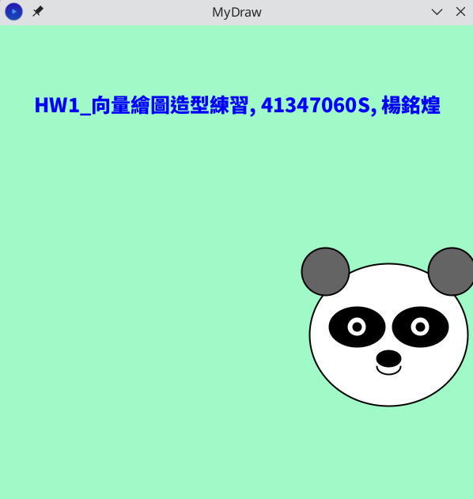
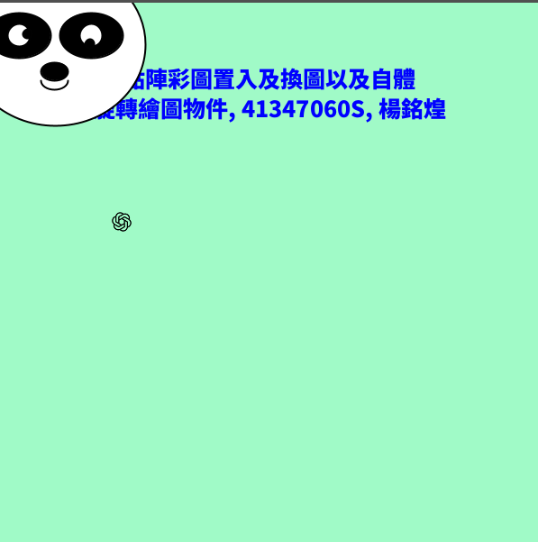
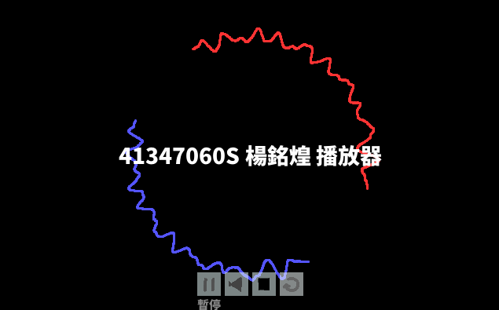
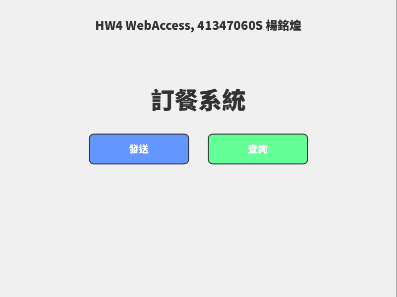
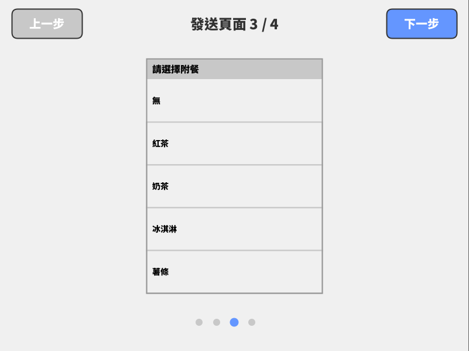
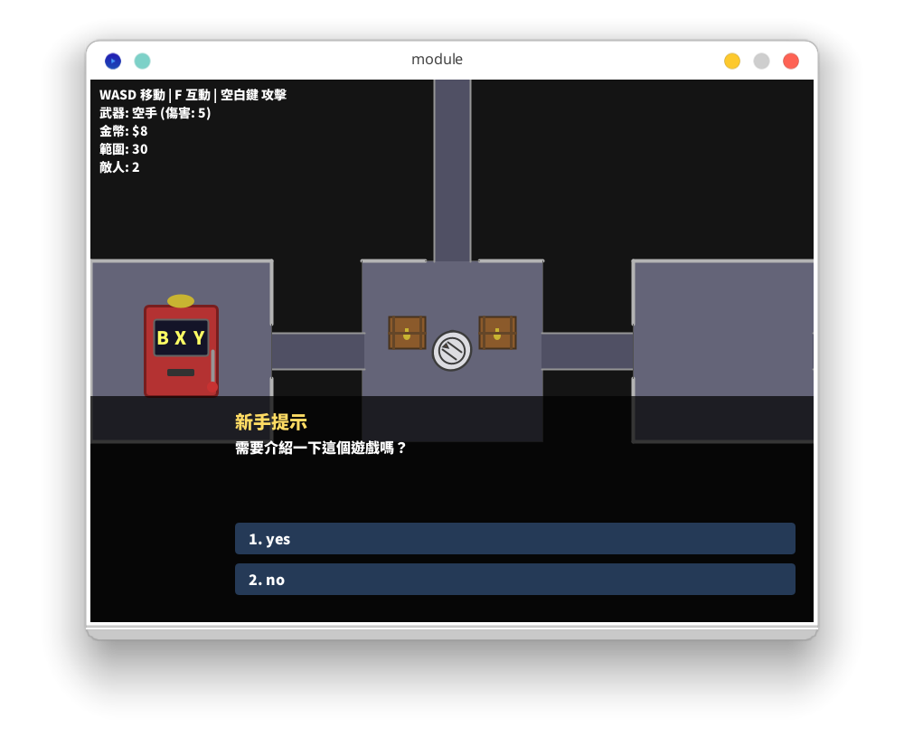
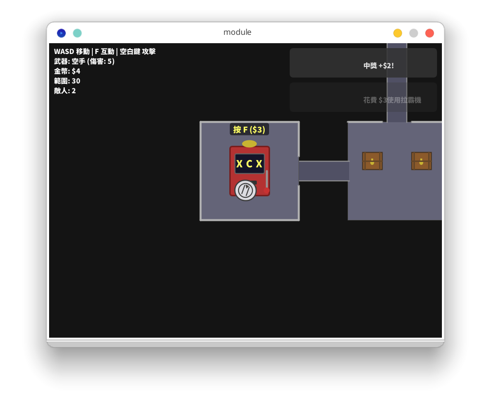
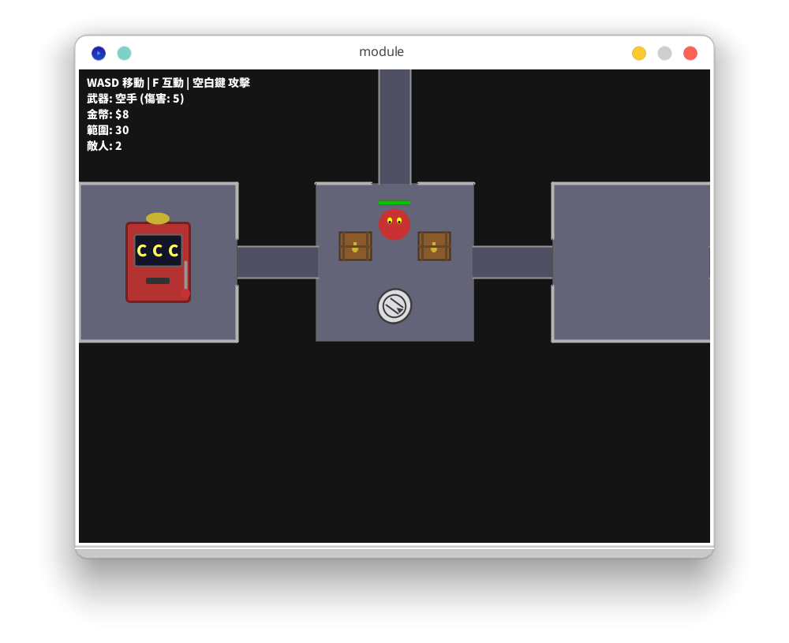

## 心得

### 期中自評

> 我一開始有一點點小看這堂課，總覺得因為是通識所以會很簡單。但是當我實際去做作業跟專案開發時，發現這個難度對我來說也就是「恰好有挑戰性」，並不是隨意就可以應付的。所以說我選課時還是有點高估自己的程式能力。不過正因如此，我在這堂課的努力CP值就會很高。
> 有作業四為證。我花了兩個晚上在Claude AI的輔助下寫了1000餘行程式，用Processing做出了簡便的點餐界面。功能上實在是不足掛齒，而且¾都是AI生成的，但我有一種感覺，這是我開始寫程式以來最清楚自己在做什麼的一個小專案，哪怕是AI生的那些部份。而且我也很少有專案能夠寫到那麼多行程式（作為對照，截至現在compil寫了692行，TBS Bot扣掉重複內容則是約1500行，但都是花很久寫的）。我覺得最大的成就是，我頭腦內的「context window」終於可以擺得下關於整個專案的資訊，而不會被大量的程式淹沒。不過我得承認，Claude功不可沒。

### Processing 與 Linux

我這學期的作業都是在 Linux 電腦上完成的。Processing 的開發體驗雖不如主流語言那樣支援完善，但總歸來說也沒有太多阻力。

我發現 Processing 程式的執行與「專案」的概念綁定在一起。它沒有辦法執行單獨的檔案，而必須要以專案的形式（放在一個資料夾底下，以資料夾名為專案名）來執行才可以。

而且，同一個專案底下所有資源是「扁平化共享」的：程式碼寫在哪個資料夾下的哪個檔案，對執行來說不影響，效果跟全部寫在同一個檔案是一樣的；素材、字體放在 `data/` 跟放在根目錄也沒有差別，引用時不用指定資料夾。雖然對於大型專案來說這大概是個惡耗，但是至少在我這學期接觸的所有專案來說，這反而是優勢：我不用擔心任何的引用問題，只要把變數名設清楚，使用起來還比一般的程式語言更輕鬆。

出人意料的是，Processing 有內建 CLI 工具，而且不用額外安裝。我最常使用的指令是「執行專案」：

```shell
processing cli --sketch=/path/to/sketch --run
```

Processing 有自己的插件管理器。不過，他在下載完之後明明會註記「已安裝」，APP 只要關閉重開，就會變回顯示「未安裝」。這點讓我很惱火，我還為此到 Windows 上測試，發現這個 bug 一樣存在。此外他的插件是全局性的（不是為每一個專案分開設置），共享資源都是放在家目錄底下。一開始還為他沒有放在 `~/.local/share/` 感到有點煩躁，但是後來想到 CurseForge 也是這樣做的就釋懷了。

### 助教

聽說助教也是資工系的。我對於他的長相沒有什麼印象，但是他每次批改作業都會給評語，而且很有「情緒價值」。看評價內容就知道，他每一個作業都是有花點心思看過的。老實說我直到後期都還算認真做作業，有一部分原因就是「希望能再繼續得到助教的稱讚」。

### AI 的使用

老師是鼓勵使用 AI 寫程式的。有一節課老師專門拿來向我們展示 Agentic Coding 的力量。他直接在現場用 chatbot 對話生出程式碼並現場執行，然後馬上解說。當時用的應該是 GPT 5，生出來的東西大致能用，但還是有一些老師的要求沒有 100% 達成。我覺得這個形式很不錯，讓我們直觀地體驗到它的力量，同時也立刻認知到他的侷限性。

受到老師的鼓勵，我在學期間大量運用 AI 來寫這門課的課堂作業跟期末專題。我使用的是 Claude Sonnet（當時的版本是 4.5）。我也嘗試過 Gemini pro（當時為 2.5），但是同樣的提示詞效果並不那麼好。

題外話：但我不覺得 Gemini 在所有程式領域都輸給 Claude。要看是哪種程式。比如，讓 Gemini 寫 Python 腳本或者問軟體相關問題是完全 OK 的，甚至還贏過 Claude，因為通常 Gemini 講的話比 Claude 多，這在一些需要多一點資訊（比如軟體除錯或者 Linux 相關知識）的時候是一個不錯的優點。

在作業四、作業五跟專題的時候，我用 Claude 生了很多「元件」出來。我很常用以下的句法：

```markdown title="提示詞"
幫我用 Processing 寫「下半屏對話框」。
**功能指定**
就是文字遊戲的對話框。
希望他有這些功能：
* 下一步、多選一、兩個 alt
* 半透明
* 左邊有放角色圖像
```

如果生出來的結果不滿意，我通常會直接改原始提示詞。我也不確定是不是我的偏見，總覺得 one-shot 產出的結果最乾淨，不會有一些想改也改不掉的怪異設計。

另外，我也覺得在這個作業中把 AI 用在產出一次性元件是個不錯的點子。

一方面，所謂的「手刻圖形界面」，不管是用 HTML5、SDL、PyGame 等等低階圖形環境，還是這裡的 Processing（不用外部函式庫的情況），都不是件容易的事——直到 AI 出現。得益於 AI 快速產出「能用的」程式的能力，撰寫 UI 時我既不用花時間學習別人的函式庫，也不用花時間自己寫。

另一方面，一次只要求「一個元件」，讓我很方便管理 AI 內容。在這個課程的作業中我不太使用 Claude Code 這種可以讀到整個專案的程式的代理式工具，而幾乎都是在網頁版應用詢問、複製、貼到我的程式。我不用擔心 AI 誤會我其他程式的設計理念，也不怕它生出來的程式片段把原本的程式搞壞了。

### UI 設計

與其說是遊戲程式設計，我覺得我在這門課透過實作學到的多半是「UI 程式設計」。我在撰寫的過程中反覆思考「怎樣的排版才是舒適的、易於操作的？」，然後構想出合適的元件需求，讓 Claude 生成，再手動加入程式。

我還覺得，雖然是 AI 生成的，而且每次生成 context 都互相隔離，但是生出來的 UI 長相倒是自成一個風格：思源黑體＋低飽和純色＋描邊。不像網路上說的「AI 經典設計」，什麼漸層、喜歡用紫色之類的都沒有發生。可能跟它沒用 HTML 有關係吧。

## 期末專題

[github.com/minstrike520/1141-ntnu-game-final](https://github.com/minstrike520/1141-ntnu-game-final)

::github{repo="minstrike520/1141-ntnu-game-final"}

## 作業歷程

- [HW1_向量繪圖造型練習作業](#作業一)
- [HW2_2D點陣彩圖置入及換圖以及自體旋轉繪圖物件作業](#作業二)
- [HW3_MediaPlayer](#作業三)
- [HW4_網路資料存取應用](#作業四)
- [HW5_Player(玩家)與NPC(非玩家)碰撞偵測](#作業五)

### 作業一



作業要求我們用程式繪製一個動物/角色形象，而且只能透過圖形繪製指令，而不能用圖片。

我實在是沒什麼靈感，就隨意畫了熊貓。當時還是用 Claude 生的程式碼，生完之後我再修改。

> 笑得我心裡發寒的dvd螢幕保護裝置，超鬧，給過👍。

### 作業二



只是給眼睛轉圈，跟加一個跟隨滑鼠的游標。

> 超ㄎ一ㄤ的螢幕保護程式👍。

### 作業三



音樂控制器。功能有暫停、靜音、停止、重播。

背景的波浪會轉動，波浪隨著音效而振動。暫停、停止時轉動停止，靜音時波浪停止。

> 很有設計感的播放器👍。

### 作業四






一個表格傳送/查詢頁面。

作業要求是串接 Google 試算表跟 Google 表單。

在整理的時候一時興起，用 Astro 在網頁上重寫了這個專案。[github.com/minstrike520/webform](https://github.com/minstrike520/webform)

::github{repo="minstrike520/webform"}

**助教評語**

> 太強了...


### 作業五







（Thuh-tshau：我發現截圖時選了 Spectacle 的「視窗截圖」，把陰影打開了，版面變得好詭異…）

地下城遊戲。加了拉霸機。有一個小怪跟一個 boss。

其實 UI 還是有點隨便。當時是繳交的前幾個小時，奮力趕出來了。

> 好玩!

