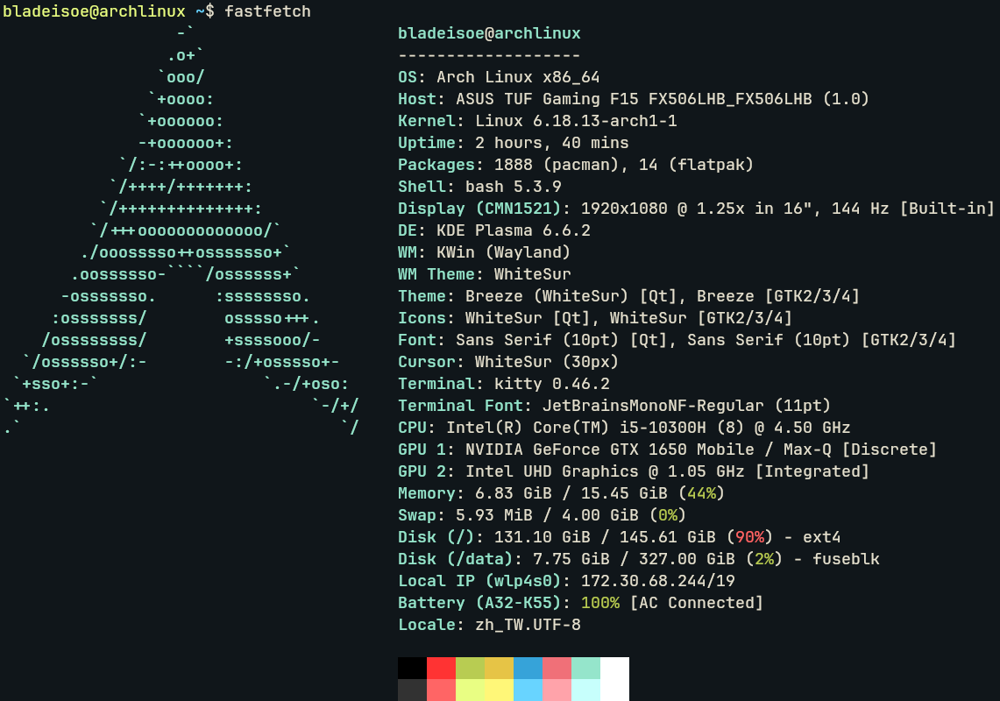
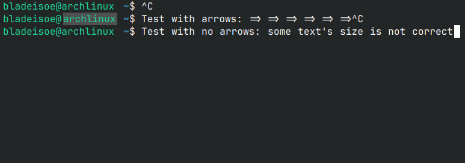

自從去年狠下心來幫筆電裝了 Arch Linux 之後，我的筆電到現在平時使用的都是 Linux 作業系統，用到現在也已經快一年了。想來記錄一下目前常用的各類軟體跟設定。

為什麼說是半個技術宅呢？這麼說吧，我雖然經常會把玩各種 Linux 相關的東西，但是太 hardcore 的我也不會碰，也沒有到專業等級，頂多能說是「有玩過」的程度。

## 作業系統與桌面環境



作業系統打從一開始就是用 Arch Linux。

還記得高三的時候為了「應該先嘗試 Ubuntu 還是 Arch Linux」猶豫了很久，最後看中 Arch 打著輕量跟高度客製化的特性，不顧「Arch 不適合新手」的警告毅然開始嘗試。不過關於作業系統的選擇又是另一個話題了。

而桌面環境一開始曾經嘗試過 Gnome 跟 Hyprland，覺得都不是很習慣，後來選了 KDE Plasma。

我覺得 KDE Plasma 使用習慣上不會跟 Windows 差太多，也沒有很多配置文件要寫。雖然說「不靠配置文件」這點使得完整搬遷 Plasma 環境變得有一點困難，但是這也有好處：**我不會花太多時間在調整他們**。

我早就知道，自己很容易陷入某種技術狂熱，要是繼續用 Hyprland，肯定會動不動就想要自訂哪個元件。雖然說這不一定是壞事，但是我想要把鑽研的心力分配到其他事情上，在桌面環境這塊就暫時從簡吧。

## 終端機

很長一段時間，我終端機使用的是 KDE 推出的 Konsole，並搭配 JetBrains Nerd Font Mono。這個字體有一個特性：在某些字元相鄰時，兩個字元會結合在一起。

效果如下：

```
=> ->
== ===
```

（本站也支援這樣的特性，所以上面應該會顯示連在一起的箭頭跟等號。）

然而 Konsole 不知為何就是無法正常顯示這些字元，只要有這些字元的存在，選取或者縮放的時候，整個終端機就會跑版：



（上圖可見，滑鼠選取的地方明顯跟其他行沒有對齊。）

我最後實在忍無可忍，於是跳槽到 [kitty](https://sw.kovidgoyal.net/kitty/) 了。

換到 kitty 之後，我也沒有研究他的客製化設定，就頂著原廠設定用了許久。直到系上某位也有在用 kitty 的 O 同學看到我這個什麼設定都不改的原始人，就跟我推銷他的設定檔。其實看起來也不太複雜，但是應用下去之後，從本來的全黑背景變成半透明、游標在移動時增加了軌跡動畫。

::github{repo="monjo123/.dotfiles"}

（O 同學的 dotfiles）


（在 neovim 看起來的效果。）

---

暫時寫到這吧。其他如文字編輯器、shell 之類的就先挖個坑，之後再來補。